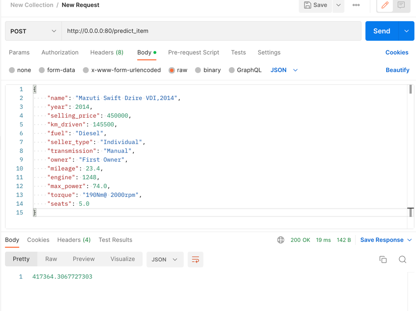

# ДЗ 1 по ML 

Дз мне не понравилось, поэтому сделано без души    

## Теперь по пунктам
### DS-часть?
Лежит в ноутбуке в корне
### Лучшая модель?
Пробил по бизнес-метрике 0.38, на этом решил остановиться
Пайплайн из OHE, плюс полиномиальные фичи
### Fastapi
Код: [тут](main.py)
#### Скриншоты

Оценка одной машины

Оценка массива машин в JSON
